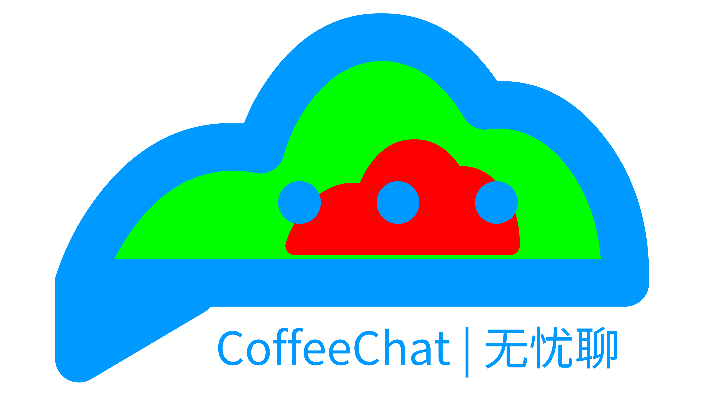
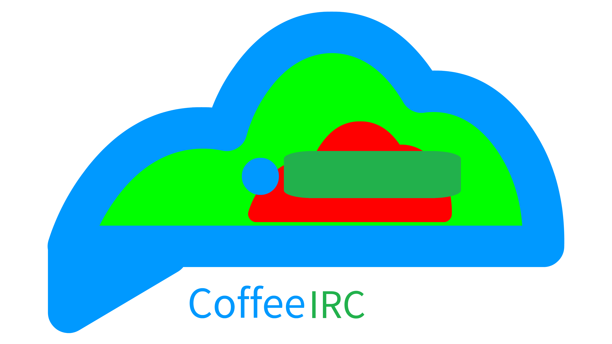

<div align="center">
  
</div>

<div align="center">

# 无忧聊 - Minecraft 聊天增强模组
### 的附属项目 咖啡IRC(CoffeeIRC,CIC)
<div align="center">
  
</div>


[](https://opensource.org/licenses/MIT)
[](https://adoptium.net/)
[](https://github.com/deplayeris/coffeeirc)

<br>CoffeeChat是一个基于NeoForge的Minecraft聊天增强模组，为玩家提供更专业、更完善的IRC聊天系统体验。<br>-----本项目为其核心部分-----
</div>

## 🎈介绍

>[!WARNING]
> 1. **本项目所编写的内容不是Minecraft模组，不是Minecraft模组，不是Minecraft模组！**<br>
> 本项目是Minecraft模组CoffeeChat的附属项目，也是核心子项目。<br>
> 如果要在Minecraft上使用CIC，必须要借助一些mod，比如无忧聊（直接内置CIC，无需额外安装）。<br>
> ---
> 2. **本项目使用了Http + WebSocket**，部分运营商或服务器商的CDN可能缺少支持或无法支持。
> ---
> 3. **本项目现在使用Linux开发模式，本项目作为核心**，而诸如无忧聊这些作为发行版。<br><br>
> **本项目无法独立运行，必须借助这些发行版**，而这些发行版可能会添加一些自定义的功能，可能会比较方便<br>
> 但是请一定选择**正规并且最好是开源**的发行版，**我们不知道也无法负责这些发行版的安全性**。<br><br>
> 至于CIC官方的发行版CDTE(CIC Default Test Environment)...只能用于测试开发。**能不能正常使用？别指望了**

为用户提供专业、完善的IRC聊天系统体验。<br>
提供了一些 api，让用户可以自定义聊天、外接程序提供功能。<br>

## 📦 安装说明

### 系统要求
- **Java版本**: JDK 25
- **语言级别**: Java 25
- 如果是在Minecraft内借助特定的发行版运行，推荐1700MB的游戏运行内存空间
- 如果是借助常规运行核心内容的发行版，推荐1100MB运行内存空间

### 编译方法

```bash
# Windows
.\gradlew build

# Linux/macOS
./gradlew build
```

编译完成后，在 `build/libs/` 目录下可以找到生成的jar文件。

### 安装步骤

#### 对于使用者
下载CoffeeIRC的jar文件.<br><br>
因为部分编码原因，在 Windows 平台上，会有乱码情况，所以请按照以下操作：<br>
如果你是Powershell用户，请使用以下命令：
```bash
[Console]::OutputEncoding = [System.Text.Encoding]::UTF8
java "-Dfile.encoding=UTF-8" -jar .\coffeeirc-xxx.jar
```
如果你是cmd用户，请使用以下命令：
```bash
chcp 65001
java "-Dfile.encoding=UTF-8" -jar .\coffeeirc-xxx.jar
```
<br><br><br><br>
如果你是其他平台的用户，请使用以下命令：
```bash
java "-Dfile.encoding=UTF-8" -jar .\coffeeirc-xxx.jar
```

#### 对于开发者
1. 下载合适CoffeeIRC版本的源码Jar
2. 解压合并入自己的源码内
3. 参考文档进行适用开发

#### 对于使用了CoffeeChat的Minecraft玩家

- 对于普通玩家<br>
  请前往[此处](https://github.com/deplayeris/coffeechat/releases)选择合适版本下载并照CoffeeChat项目的README.md中说明进行安装。
> [!WARNING]
> **请勿将本项目的可运行Jar安装进游戏，本项目所编写的内容不是Minecraft模组，不是Minecraft模组，不是Minecraft模组！**

- 对于高技术玩家<br>
  照CoffeeChat项目的README.md中说明进行下载源码之后,请参考【安装步骤/对于开发者-2.】，然后进行编译。
> [!WARNING]
> **请谨慎考虑它与某些版本的CoffeeChat的兼容性，所使用的CoffeeIRC核心相对于这一某个版本是过旧版本或过新版本都可能导致兼容性问题。**

## 📚 文档

开发者可以在 [`docs`](docs/) 文件夹中查看详细的开发文档和API说明。<br>
我们也提供了Javadoc，可以前往[CIC文档中心](https://deplayeris.github.io/coffeeirc)

## 🤝 贡献指南

我们欢迎任何形式的贡献！请查看详细的 [贡献规范](../coffeechat/CONTRIBUTING.md) 了解完整的提交和PR规范。

### 快速开始

1. **Fork项目** 到你的GitHub账户
2. **克隆到本地**：
   ```bash
   git clone https://github.com/yourusername/coffeechat.git
   cd coffeechat
   ```
3. **创建功能分支**：
   ```bash
   git checkout -b feature/your-feature-name
   ```
4. **进行开发** 并遵循 [贡献规范](../coffeechat/CONTRIBUTING.md)
5. **提交更改** 并推送
6. **创建Pull Request"

### 文档说明

- **外部贡献文档**：位于源代码根目录（如本README、CONTRIBUTING.md等）
- **内部开发文档**：请写入 [`docs/`](docs/) 文件夹内

### 代码规范
- 使用Java 25语法特性
- 遵循NeoForge开发最佳实践
- 确保良好的代码文档和注释

## 📄 许可证与遵循协议

本项目采用 **MIT许可证**，详情请参见 [LICENSE](LICENSE) 文件。

```
/*
MIT License

Copyright (c) 2026 Deplayer

Permission is hereby granted, free of charge, to any person obtaining a copy
of this software and associated documentation files (the "Software"), to deal
in the Software without restriction, including without limitation the rights
to use, copy, modify, merge, publish, distribute, sublicense, and/or sell
copies of the Software, and to permit persons to whom the Software is
furnished to do so, subject to the following conditions:

The above copyright notice and this permission notice shall be included in all
copies or substantial portions of the Software.
*/
```

## 📞 联系方式

- **作者**: Deplayer
- **邮箱**: deplayer515@hotmail.com
- **GitHub Issues**: [提交问题报告](https://github.com/deplayeris/coffeechat/issues)

## 🙏 致谢

感谢所有为这个项目做出贡献的开发者、Fabric开发组、社区教程大佬、使用者们！

---